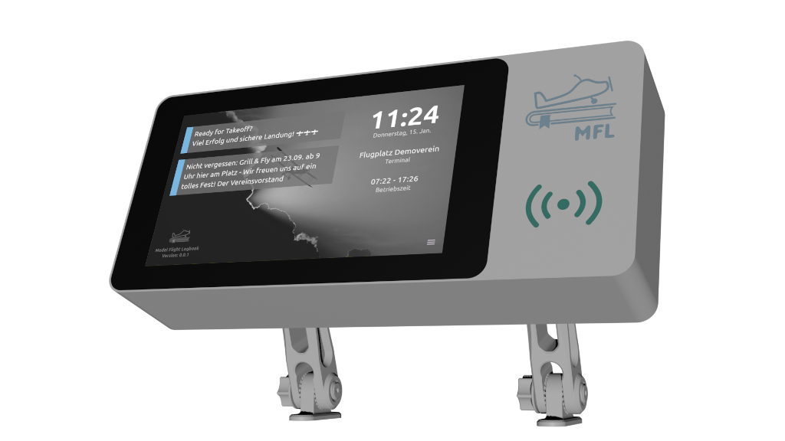

# Model Flight Logbook
 

 
Das **Model Flight Logbook (MFL)** ist ein digitales Flugbuch für Modellflugvereine. 
Die Anwendung ist **einfach, übersichtlich und praxisnah** konzipiert und unterstützt Pilot:innen sowie Vereine bei der **Einhaltung der gesetzlichen Anforderungen in Österreich**.

MFL eignet sich insbesondere für den Einsatz als **Touch-Kiosk-Terminal am Flugplatz** und bietet zusätzlich eine **Web-basierte Verwaltungs- und Auswertungsplattform**.

## Für Pilot:innen

- **Übersichtliches, touch-optimiertes Kiosk-Terminal**  
  Intuitive Bedienung – geeignet für Jung und Alt

- **Digitales Flugbuch per Check-In / Check-Out**  
  Protokollierung der Anwesenheit und gesetzlich erforderlicher Informationen

- **Flexible Benutzer-Identifizierung**  
  Anmeldung per RFID-Chip oder über sonstige Eingabegeräte (z. B. Tastatur, Ziffernblock, …)

- **Dokumenten-Überwachung**  
  Warnungen am Terminal vor Ablauf des Drohnenführerscheins oder der Registrierung

- **Automatisches Flugverbot**  
  Bei fehlenden oder abgelaufenen Pflichtdokumenten

- **Individuelle und globale Hinweise**  
  Infos, Warnungen oder Flugverbotsmeldungen – global oder personenbezogen  

- **Tagesaktuelle Betriebszeiten**  
  Berücksichtigung der erlaubten Flugzeiten (CMT bis CET)  

- **Export des persönlichen Flugbuchs**  
  Versand per E-Mail über das MFL Terminal  

## Für Vereinsvorstände

- **Web-basiertes Verwaltungsportal (MFL-Admin)**  
  Zentrale Administration aller Piloten- und Flugdaten

- **CSV-Export des Flugbuchs**  
  Mit einem Klick, z. B. für behördliche Einreichungen

- **Verwaltung von Infos, Warnungen und Flugverboten**  
  Global oder pilotenspezifisch definierbar

- **Aussagekräftige Jahresstatistiken**  
  Übersicht über Auslastung, Flugzeiten und Aktivitäten

- **E-Mail-Benachrichtigungen an den Administrator**  
  Z.B. Bei Einträgen unter „Besondere Ereignisse“

- **Automatische Beendigung vergessener Check-Outs**  
  Inklusive Benachrichtigung an die betroffene Pilot:in

- **Kostengünstig**  
  MFL ist kostenlos und kann auf günstiger Hardware betrieben werden

## Für Systemadministrator:innen

- **Installations-Script für ein vollständiges Setup**  
  Schnelle und einfache Inbetriebnahme

- **Update-Script für einfache Aktualisierungen**  
  Per Cronjob automatisierbar

- **REST-API**  
  Für die Anbindung an Fremdsysteme

- **Unterstützung von komplexen Setups, wie:**  
  - Mehrere MFL Terminals auf einem Flugplatz  
  - Mehrere Flugplätze pro Verein (z.B. Tal- und Hangflugplatz)  
  - Ein Terminal unterstützt mehrere Server (z.B. bei Flugplatz-Sharing)

# Videos

<table >
  <tr>
    <td >
      <a href="https://www.youtube.com/watch?v=kF_Z988H-uU" target="_blank"> YouTube öffnen</a></td>
    <td>
    <a href="https://www.youtube.com/watch?v=mCskDqg9cJ4" target="_blank"> YouTube öffnen</a>
    </td>
  </tr>
</table>

# Anforderungen
TODO
* Person mit IT Kenntnissen TODO
* Computernetzwerk TODO
* Hardware für Standardsetup TODO

# Setup
TODO
* Bau des Terminals TODO
* Installation TODO

# Disclaimer
Der Haftungsausschluss ist grundsätzlich bereits über die verwendete Lizenz geregelt. Trotzdem weise ich an dieser Stelle noch einmal explizit darauf hin, dass es sich hier um ein privates Projekt handelt. Keines der Funktionalitäten wurde mit öffentlichen Stellen abgestimmt. Der Einsatz des Systems erfolgt auf vollständiges Risiko des Betreibers.

