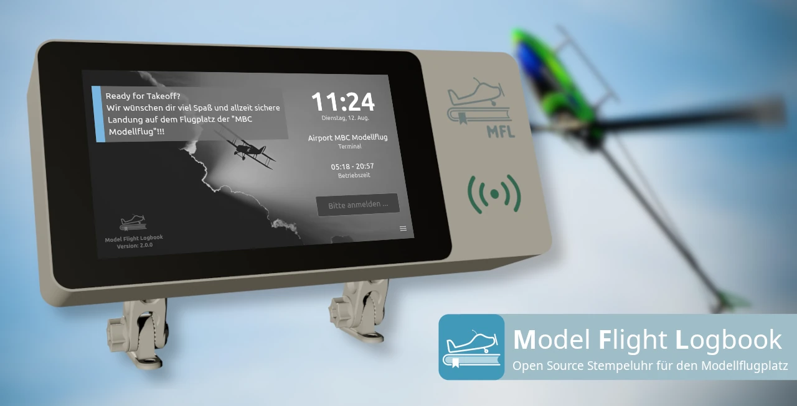

# Model Flight Logbook
<br/>

Das ***Model Flight Logbook (MFL)*** ist ein digitales Flugbuch für Modellflugvereine. 
Die Anwendung ist ***einfach, übersichtlich und praxisnah*** konzipiert und unterstützt Pilot:innen sowie Vereine bei der ***Einhaltung der gesetzlichen Anforderungen in Österreich***.

MFL eignet sich insbesondere für den Einsatz als ***Touch-Kiosk-Terminal am Flugplatz*** und bietet zusätzlich eine ***Web-basierte Verwaltungs- und Auswertungsplattform***.

# ⚠  ⚠  ⚠  UNDER CONSTRUCTION  ⚠  ⚠  ⚠ 
Ich arbeite mit Hochdruck daran, alle Unterlagen fertigzustellen... bitte bis dahin noch warten :)

# Features
## Feature-Videos
  [***🎥  MFL Terminal Funktionsübersicht (YouTube)***](https://www.youtube.com/watch?v=kF_Z988H-uU)  
  [***🎥  MFL Admin Funktionsübersicht (YouTube***)](https://www.youtube.com/watch?v=mCskDqg9cJ4)  
## Für Pilot:innen / Mitglieder
- ***Übersichtliches, touch-optimiertes Kiosk-Terminal***  
  Intuitive Bedienung – geeignet für Jung und Alt
- ***Digitales Flugbuch per Check-In / Check-Out***  
  Protokollierung der Anwesenheit und gesetzlich erforderlicher Informationen
- ***Flexible Benutzer-Identifizierung***  
  Anmeldung per RFID-Chip oder über sonstige Eingabegeräte (z. B. Tastatur, Ziffernblock, …)
- ***Dokumenten-Überwachung***  
  Warnungen am Terminal vor Ablauf des Drohnenführerscheins oder der Registrierung
- ***Automatisches Flugverbot***  
  Bei fehlenden oder abgelaufenen Pflichtdokumenten
- ***Individuelle und globale Hinweise***  
  Infos, Warnungen oder Flugverbotsmeldungen – global oder personenbezogen  
- ***Tagesaktuelle Betriebszeiten***  
  Berücksichtigung der erlaubten Flugzeiten (CMT bis CET)  
- ***Export des persönlichen Flugbuchs***  
  Versand per E-Mail über das MFL Terminal  

## Für Vereinsvorstände
- ***Web-basiertes Verwaltungsportal (MFL-Admin)***  
  Zentrale Administration aller Piloten- und Flugdaten
- ***CSV-Export des Flugbuchs***  
  Mit einem Klick, z. B. für behördliche Einreichungen
- ***Verwaltung von Infos, Warnungen und Flugverboten***  
  Global oder pilotenspezifisch definierbar
- ***Aussagekräftige Jahresstatistiken***  
  Übersicht über Auslastung, Flugzeiten und Aktivitäten
- ***E-Mail-Benachrichtigungen an den Administrator***  
  Z.B. Bei Einträgen unter „Besondere Ereignisse“
- ***Automatische Beendigung vergessener Check-Outs***  
  Inklusive Benachrichtigung an die betroffene Pilot:in
- ***Kostengünstig***  
  MFL ist kostenlos und kann auf günstiger Hardware betrieben werden

## Für Systemadministrator:innen
- ***Installations-Script für ein vollständiges Setup***  
  Schnelle und einfache Inbetriebnahme
- ***Update-Script für einfache Aktualisierungen***  
  Per Cronjob automatisierbar
- ***REST-API***  
  Für die Anbindung an Fremdsysteme
- ***Unterstützung von komplexen Setups, wie:***  
  - Mehrere MFL Terminals auf einem Flugplatz  
  - Mehrere Flugplätze pro Verein (z.B. Tal- und Hangflugplatz)  
  - Ein Terminal unterstützt mehrere Server (z.B. bei Flugplatz-Sharing)

  
# Anforderungen
Aufgrund der gewählten Systemarchitektur und der eingesetzten Technologien kann das MFL-System in unterschiedlichsten Konfigurationen betrieben werden – beispielsweise vollständig lokal auf einem einzelnen PC, mit einem Server im Internet oder auf verschiedenen Betriebssystemen wie Windows, Linux, Android oder iOS.

Um die Dokumentation übersichtlich und die Komplexität möglichst gering zu halten, wird im Folgenden ausschließlich ein einziges Setup beschrieben, welches für die Mehrzahl der Modellflugvereine geeignet sein sollte. Fragen zu alternativen Setups oder abweichenden Betriebsformen können gerne über [GitHub Discussions](https://github.com/soumas/model-flight-logbook/discussions/categories/q-a) gestellt werden.

## Rahmenbedingungen
### Installation, Wartung und Betrieb
Die Installation und der Betrieb von MFL sind grundsätzlich einfach. Trotzdem ist ein gewisses Maß an IT Verständnis nötig, um das System mit gutem Gewissen warten und einsetzen zu können. Es ist also Grundvoraussetzung, dass es jemanden im Verein gibt der sich um das System kümmert. Diese Person muss kein Experte sein, aber einen Raspberry Pi aufzusetzen und in ein Netzwerk zu hängen sollte sie beherrschen. Auch Schlagwörter wie Linux, SSH, Bash und crontab sollten ihr nicht gänzlich unbekannt sein.

### Infrastruktur
MFL sollte nach Möglichkeit Zugriff zum Internet haben. Eine rechtskonforme Flugbuchführung ist zwar auch ohne möglich, allerdings gibt es gravierende Einschränkungen. Neben der Notwendigkeit eines zusätzlichen RTC-Modules (damit der Raspberry Pi die Zeit nicht vergisst), aufwändiger Wartung (Updates) und fehlenden E-Mail Benachrichtigungen ist die ***Datensicherung*** das Hauptproblem.

## Hardware
Für den Aufbau des MFL Systems sind folgende Hardware-Komponenten erforderlich.
* ***Raspberry Pi 4 model B***  
Grundsätzlich kann jedes Raspberry Pi Modell verwendet werden, welches das Betriebssystem "Raspberry Pi OS 64-bit" unterstützt und mit dem Touch Display kompatibel ist.  
https://www.raspberrypi.com/products/raspberry-pi-4-model-b/
* ***microSD Karte***  
Auch wenn MFL nur wenig Speicherbedarf hat, empfiehlt es sich eine microSD mit mindestens 32 GB Speicher einzusetzen. Außerdem sollte auf eine gute Qualität und Temperaturbeständigkeit geachtet werden, um MFL auch in unklimatisierter Umgebung möglichst lange ohne Ausfall (mehr dazu unter "Backup") betreiben zu können.
* ***Raspberry Pi 7″ Touch Display (800 x 480 Pixel)***  
Das originale Touch Display (Version 1) harmoniert perfekt mit dem Raspberry Pi 4 model B und hat mit 800 x 480 Pixel eine optimale Auflösung. Kein Setup und problemloser Betrieb.  
https://www.raspberrypi.com/products/raspberry-pi-touch-display/
* ***USB RFID-Scanner***  
Der RFID Scanner wird per USB an den Raspberry Pi angeschlossen  
https://www.neuftech.net/products/40
* ***MFL Terminal Gehäuse***  
Die 3D-Druckdateien für das originale MFL Terminal Gehäuse stehen auf thingiverse.com zur Verfügung. Der Druck ist nicht sonderlich schwierig und wird unter Befolgung der Hinweise bestimmt problemlos klappen. Wer keinen passenden 3D-Drucker hat aber trotzdem das originale Gehäuse haben möchte, möge sich gerne an office@soumasoft.com wenden.  
https://www.thingiverse.com/thing:7279187  
Alternativ kann natürlich jedes andere Gehäuse verwendet werden, in dem das Display und der Raspberry Pi Platz finden.   
* ***Diverse Kleinteile***  
 Für die Befestigung des Terminals, den Einbau in das Gehäuse und die Verkabelung sind diverse Kleinteile nötig, die aber teilweise vom Setup abhängig sind und hier wohl nicht vollständig aufgelistet werden können.  

# Installation
## Raspberry Pi vorbereiten
1. ***Touch Display an Raspberry Pi anschließen***  
[🎥  Videoanleitung - Raspberry Pi Touch Display anschließen (YouTube)](https://youtu.be/rG4MDcAez1c)  
[📖 Originale Dokumentation (raspberrypi.com)](https://www.raspberrypi.com/documentation/accessories/display.html)  
2. ***"Raspberry Pi OS (64-bit)" installieren***  
🛈 Tipp: SSH aktivieren & verwenden (Touch ist zu umständlich für administrative Tätigkeiten, ```sudo raspi-config``` --> Interface Options)  
🛈 Tipp: "Screen Blanking" aktivieren damit sich das Display bei Inaktivität ausschalet (```sudo raspi-config``` --> Display Options)  
https://www.raspberrypi.com/software/

## MFL Installation  
Die Installation aller MFL Komponenten (MFL-Server inkl. MFL-Admin & MFL-Terminal) erfolgt durch ein einiziges Installationsscript. Dieses läuft vollautomatisch mit einer Ausnahme: während des Installationsvorgangs öffnet sich eine Server-Konfigurationsdatei welche mit entsprechenden Angaben ergänzt werden muss. Um hierfür vorbereitet zu sein, machen Sie sich vorab mit allen Servereinstellungen vertraut.

### Beispiel einer server-config.ini Datei
Die meisten Konfigurationen sind mit Standardwerten versehen und müssen deshalb nicht angegeben werden. Folgendes Beispiel zeigt eine minimale aber vollständige Konfigurationsdatei:

```ini
[logbook]
apikey_admin = SiChErEsPwD%!X72$
admin_email = admin@mbc-modellflug.at

[terminalconfig_terminal1]
terminalname = Terminal 1
apikey = P@ssWo&tFuerTe+min$l1
airportname = Airport MBC Modellflug

[smtp]
server = smtp.mbc-modellflug.at
from_email = admin@mbc-modellflug.at
username = mailbox_benutzername
password = mailbox_passwort

```

### MFL-Servereinstellungen

Alle Servereinstellungen werden folgend gelistet. Bitte prüfen, ob die Standardwerte - insbesondere Maximal zulässige Flughöhe usw. - mit den Vorgaben des betroffenen Flugplatzes übereinstimmen und überschreiben Sie sie ggf. in der server-config.ini-Datei.

| Kategorie/Schlüssel        | Standardwert               | Beschreibung       |
| ---                | ---                        | ---                |
| **[logbook]** |
| apikey_admin                    | admin                      | Api-Key (Passwort) für administrative Endpunkte und den MFL-Admin |
| dburl                           | sqlite:///./data.db        | Database URL (siehe [SQLAlchemy Documentation](https://docs.sqlalchemy.org/en/21/core/engines.html)) |
| admin_email                     |                            | E-Mail Adresse, an die Systemnachrichten gesendet werden |
| forward_comment                 | True                       | Bleibt das Bemerkungsfeld beim Beenden eines Flugtages nicht leer, so wird eine Nachricht an den Systemadministrator versendet ('False' um Feature zu deaktivieren) |
| debug                           | False                      | Erweitertes Logging für Analyse und Fehlersuche |
| **[smtp]**                      |
| server                          |                            | Serveradresse       |
| port                            | 465                        | Port                |
| username                        |                            | Benutzername        |
| password                        |                            | Passwort            |
| from_email                      |                            | Versender E-Mail Adresse |
| from_name                       |                            | Versender Name      |
| starttls                        | False                      | Verwende starttle für Mailversand |
| ssl_tls                         | True                       | Verwende ssl_tls für Mailversand |
| use_credentials                 | True                       | Login an SMT Server erforderlich |
| validate_certs                  | True                       | Zertifikatsprüfung durchführen |
| timeout                         | 60                         | Maximale Zeit (in Sekunden) für den Verbindungaufbau zum SMT Server |
| template_folder                 | ./resources/mailtemplates/ | Ordner mit E-Mail Vorlagen für den Mailversand |
| suppress_send                   | False                      | Unterbindet den Mailversand |
| **[terminalconfig_{ID}]**       |
| apikey                          |                            | Api-Key (Passwort) mit dem sich das Terminal am Server authentifizieren muss |
| terminaltype                    |                            | Art des MFL Terminals (aktuell wird nur 'multiuser' unterstützt)  |
| airportname                     |                            | Bezeichnung des Flugplatzes |
| terminalname                    |                            | Bezeichnung des Terminals |
| max_altitude_m                  | 150                        | Maximal zulässige Flughöhe in Meter (mit Luftraumbeobachter) |
| max_altitude_without_observer_m | 119                        | Maximal zulässige Flughöhe in Meter (ohne Luftraumbeobachter) |
| max_num_flights                 | 25                         | Maximalanzahl an Flügen für einen Logbucheintrag |
| operatinghourscsv               | ./resources/operatinghours/AUSTRIA_MIN.csv  | Pfad zur Betriebszeiten CSV Datei |
| dashboard_show_pilotid          | False                      | Definiert, ob die Piloten-ID während der Eingabe auf dem Dashboard angezeigt werden soll |
| dashboard_info_messages         |                            | Info-Nachrichten auf dem Dashboard (mehrere durch Beistrich getrennt) |
| pilot_info_messages             |                            | Info-Nachrichten an alle Piloten (mehrere durch Beistrich getrennt) |
| pilot_warn_messages             |                            | Warn-Nachrichten an alle Piloten (mehrere durch Beistrich getrennt) |
| pilot_error_messages            |                            | Flugverbots-Nachrichten an alle Piloten (mehrere durch Beistrich getrennt) |

### Installationsscript ausführn
Durch die Ausführung folgender Befehle wird sowol der MFL-Server als auch das MFL-Terminal installiert. 

```bash
# system aktualisieren
sudo apt update && sudo apt upgrade -y

# Im Home-Verzeichnis den Unterordner "mfl" erstellen und hin navigieren
mkdir ~/mfl && cd ~/mfl

# mfl installationsscript herunterladen und ausführbar machen
wget https://github.com/soumas/model-flight-logbook/raw/refs/heads/main/installer/install.sh && chmod +x install.sh

# mfl-server und mfl-terminal installieren
# Die Server-Konfig öffnet sich mit dem Konsolen-Texteditor "nano". nano kann mit Strg+x und anschließend Strg+y + Enter beendet werden.
# nach der Installation sollte sich das MFL Terminal automatisch öffnen
./install.sh

# der installer kann abschließend gelöscht werden
rm install.sh

# Note: Durch die erneute Ausführung des install-Scripts kann MFL vollständig deinstalliert werden (Achtung, auch Config und DB werden gelöscht)
```

# Betrieb

## Backup
Die MFL Flugbuch-Daten werden gesammelt in einer SQLite-Datenbank gespeichert. SQLite ist ein sehr populäres Datenbanksystem, welches alle Informationen in einer einzigen Datei speichert. Diese Datei kann nicht nur von MFL, sondern notfalls auch mit jedem SQLite-fähigen Datenbankbrowser geöffnet werden. Im Optimalfall wird die Datei über das Internet regelmäßig auf einen externen Speicher übertragen (SFTP, Cloud, ...).  
Bei einer MFL Standardinstallation (wie oben beschrieben) befindet sich diese Datei hier: 
* **~/mfl/mfl-server-8082/data.db**

***⚡⚡⚡ Achtung ⚡⚡⚡*** Ein tägliches Backup dieser Datei ist ein absolutes **must have**! Die Austro Control kann bekanntlich Auszüge davon anfordern und dann **müssen** die Daten verfügbar sein! Meine Erfahrung zeigt, dass die microSD Karten im Raspberry Pi früher oder später kaputt werden - insbesondere dann, wenn das Gerät in einem unklimatisierten Umfeld betrieben wird, wie es bei Vereinshütten häufig der Fall ist. Mit einem tagesaktuellen Datenbank-Backup ist das kein Problem und die Wiederherstellung im Handumdrehen erledigt.  

Nice to have ist auch eine einmalige Sicherung der Datei ~/mfl/mfl-server-8082/server-config.ini damit man sich die Konfigurationswerte bei der Wiederherstellung nicht wieder mühsam zusammensuchen muss.

## Updates
🛈 Tipp: Um aktiv informiert zu werden wenn es ein neues Release gibt, bitte eine kurze Nachricht mit Vereinsbezeichnung und E-Mail an office@soumasoft.com senden  

Durch die Ausführung folgender Befehle wird sowol der MFL-Server als auch das MFL-Terminal auf die aktuellste Version gehoben. 
Während des Vorganges wirden sowohl das Terminal als auch der Server neu gestartet.
```bash
# system aktualisieren
sudo apt update && sudo apt upgrade -y

# Im den Unterordner "mfl" wechseln
cd ~/mfl

# ⚠ NUR BEIM ERSTEN UPDATE NÖTIG ⚠ mfl updatescript herunterladen und ausführbar machen
wget https://github.com/soumas/model-flight-logbook/raw/refs/heads/main/installer/update.sh && chmod +x update.sh

# Update durchführen
./update.sh

```

# Fragen oder Anregungen?
Bitte gerne über [GitHub Discussions](https://github.com/soumas/model-flight-logbook/discussions/categories/q-a) oder an office@soumasoft.com

# Disclaimer
Der Haftungsausschluss ist grundsätzlich bereits über die verwendete Lizenz geregelt. Trotzdem weise ich an dieser Stelle noch einmal explizit darauf hin, dass es sich hier um ein privates Projekt handelt. Keines der Funktionalitäten wurde mit öffentlichen Stellen abgestimmt. Der Einsatz des Systems erfolgt auf vollständiges Risiko des Betreibers.  
Bitte beachten, dass sich in der Datenbank-Datei personenbezogene Informationen der Vereinsmitglieder befinden. Insofern ist darauf zu achten, dass sowohl MFL an sich als auch der Backup-Vorgang DSGVO konform betrieben werden.

